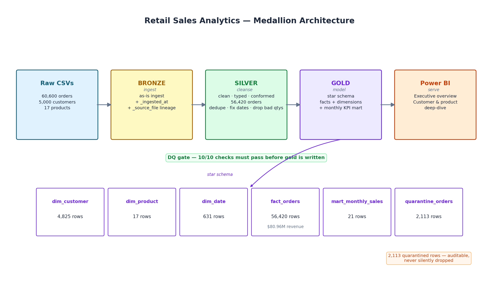
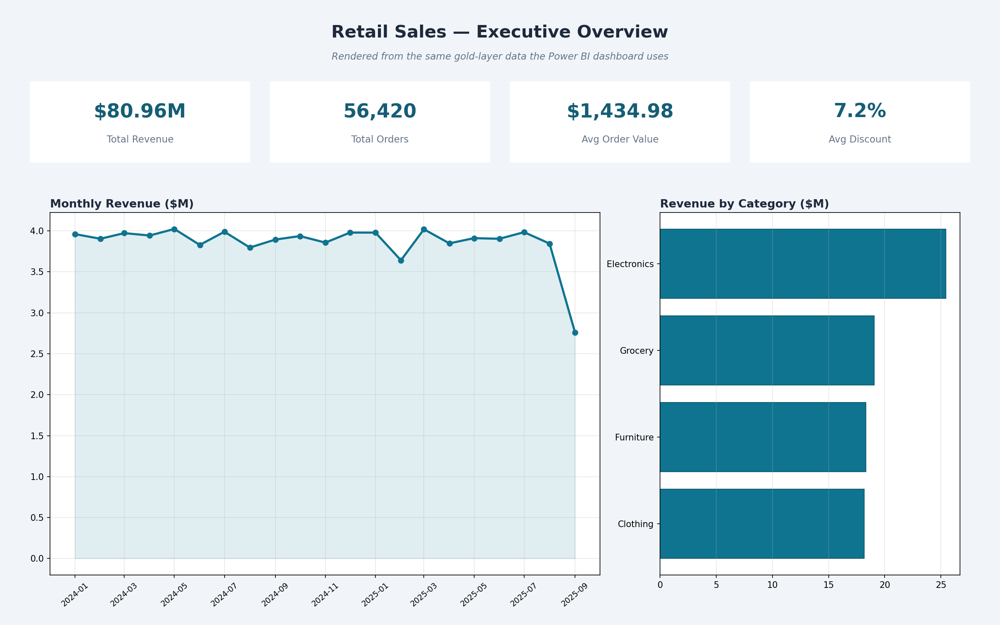
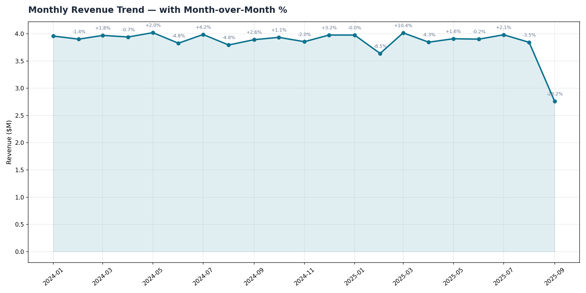
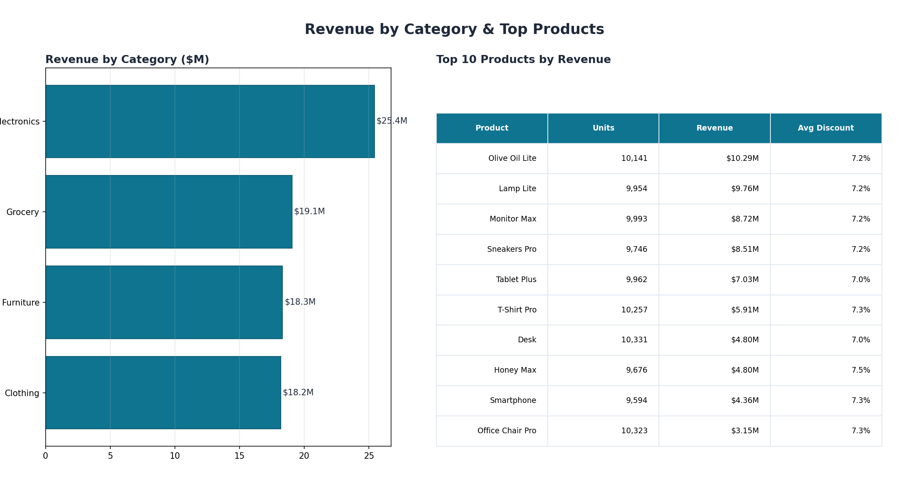
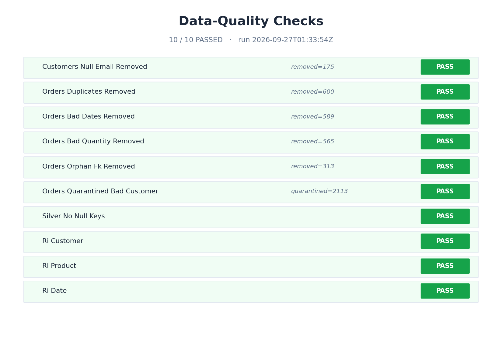
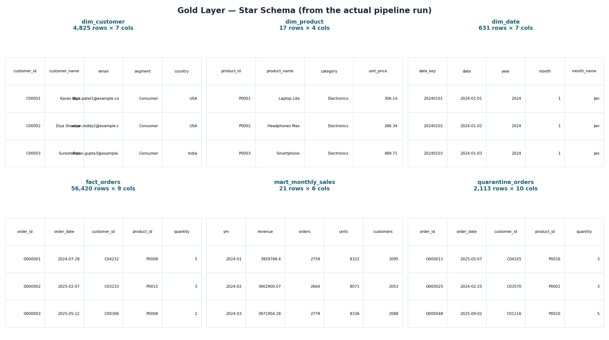
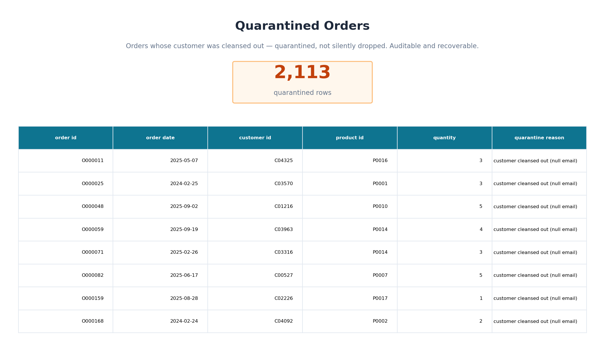
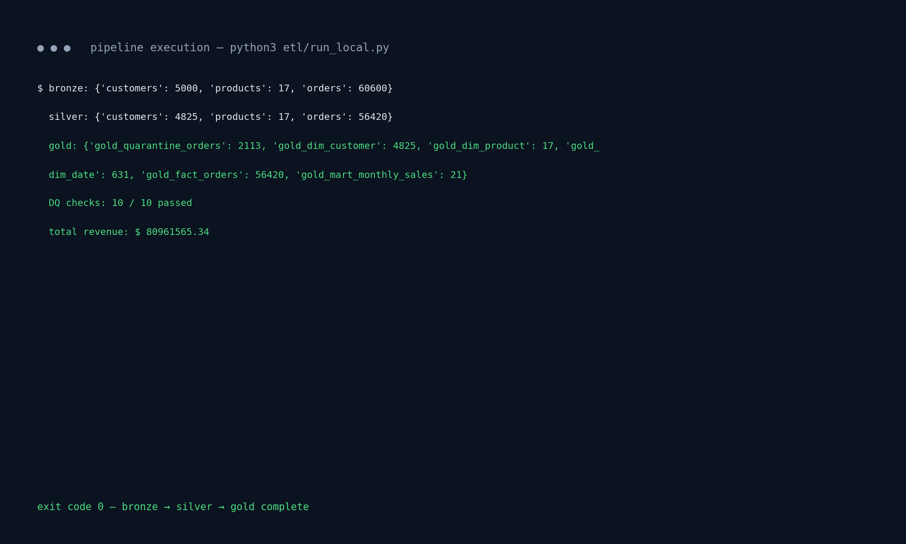

# Retail Sales Analytics — Batch Lakehouse & Power BI Pipeline

A complete, runnable analytics project: messy raw e-commerce data → cleansed
lakehouse → star-schema gold layer → KPI queries → Power BI dashboard.
Every step runs end to end: the pipeline, the data-quality checks, and the dashboard spec.

## Architecture



```
data/raw/*.csv ──▶ BRONZE (as-is + _ingested_at, _source_file)
                        │ dedupe · fix dates · drop bad qtys · conform keys
                        ▼
                   SILVER (clean, typed, conformed)
                        │ quarantine bad-customer orders (not silent drops)
                        ▼
                   GOLD star schema ──▶ Power BI dashboards
                        ├── dim_customer / dim_product / dim_date
                        ├── fact_orders (56,420 rows, $80.96M)
                        ├── mart_monthly_sales (pre-aggregated KPIs)
                        └── quarantine_orders (2,113 rows, auditable)
```

## What's inside

| Folder | Contents |
|---|---|
| `etl/generate_data.py` | Builds the raw dataset (5,000 customers, 17 products, 60,600 orders) with realistic quality issues |
| `etl/run_local.py` | Full medallion pipeline, runnable with plain Python + pandas; **10/10 DQ checks pass** |
| `notebooks/databricks_etl.py` | Same pipeline in PySpark for Databricks Runtime (Delta Lake, Unity Catalog) |
| `sql/gold_models.sql` | Star-schema DDL |
| `sql/kpi_queries.sql` | 6 KPI queries (MoM growth, repeat rate, cohorts…) |
| `powerbi/dashboard_spec.md` | 2-page dashboard layout + DAX measures |
| `powerbi/BUILD_GUIDE.md` | Click-by-click steps to build the `.pbix` in Power BI Desktop (~10 min) |
| `sample_data/` | 500-row safe sample of raw orders + column documentation |
| `docs/render_evidence.py` | Renders every image in `docs/` from a live pipeline run (matplotlib) |
| `docs/images/` | Evidence screenshots rendered from real pipeline outputs |
| `docs/interview_talk_track.md` | How to explain this project in 2 minutes + likely Q&A |
| `tests/test_pipeline.py` | Real assertions over pipeline outputs (run in CI) |
| `.github/workflows/ci.yml` | GitHub Actions: install → generate data → run pipeline → pytest |

## Run it

```bash
cd retail-sales-analytics
python3 etl/generate_data.py   # create raw data
python3 etl/run_local.py       # bronze → silver → gold, DQ report to data/dq_report.json
python3 -m pytest tests/ -v    # verify outputs
```

The PySpark notebook is designed for execution on Databricks Runtime; this path has not yet been independently executed.

## Power BI dashboard

The dashboard is defined by `powerbi/dashboard_spec.md` (layout + DAX measures)
and built by following `powerbi/BUILD_GUIDE.md` — about 10 minutes of
click-by-click steps in Power BI Desktop. The `.pbix` is built via the guide in
powerbi/BUILD_GUIDE.md (needs Power BI Desktop, which is Windows-only, so the
`.pbix` is not generated on Linux CI).

**Note:** the visuals below are **matplotlib renders** produced from the
gold-layer data (via `docs/render_evidence.py`) — they are **not** screenshots
of Power BI Desktop. This repo provides only a Power BI build guide
(`powerbi/BUILD_GUIDE.md`); no `.pbix` file is included, because Power BI
Desktop is Windows-only.


*Executive overview: KPI cards, monthly revenue trend, revenue by category —
matplotlib render from the gold-layer data, not a Power BI screenshot.*


*Monthly revenue trend with month-over-month % — matplotlib render from the
gold-layer data, not a Power BI screenshot.*


*Revenue by category and top 10 products — matplotlib render from the
gold-layer data, not a Power BI screenshot.*

## Pipeline evidence (from a real run)


*All 10 data-quality checks passing, with per-check details.*


*Gold layer: dimensions, fact table, monthly mart, and quarantine — row counts
and sample rows from the actual run.*


*2,113 quarantined orders with reasons — auditable, not silently dropped.*


*Captured stdout of a successful `etl/run_local.py` run: bronze → silver →
gold, exit code 0.*

## Results and Limitations

**Validated on a real run of this repo's pipeline** (2026-09-27, reproduced on
a clean checkout):

CI (`.github/workflows/ci.yml`) runs the data generator, medallion pipeline,
and pytest suite on every push — these exact steps were verified passing on a
clean checkout.

- 56,420 clean fact rows, $80.96M total revenue
- 10/10 data-quality checks passing (dedup, date fixing, quantity/FK rules,
  referential integrity on all three dimensions)
- 2,113 quarantined rows, each with a recorded reason

**Limitations:**

- The dataset is **synthetic**: generated by `etl/generate_data.py` (seeded with
  `random.seed(42)`, so every run reproduces identical data). It is not real
  customer data.
- The local pipeline runs on a single machine with pandas. The
  `notebooks/databricks_etl.py` notebook ports the identical logic to PySpark /
  Delta Lake for Databricks, but that path was not executed in this environment.
- The dashboard PNGs above are matplotlib renders of the gold-layer data,
  captioned as such — they are not screenshots of Power BI Desktop. The genuine
  `.pbix` is built by following `powerbi/BUILD_GUIDE.md`.

## Design decisions

- Bad rows go to quarantine instead of just disappearing. Orders that point to
  customers removed during cleansing land in `quarantine_orders` with a reason
  attached, so they can be audited or recovered later.
- The executive dashboard reads from `mart_monthly_sales`, a pre-aggregated
  mart — it isn't scanning raw tables every time someone opens the dashboard.
- Data-quality checks are a gate, not a report. If any check fails (null keys,
  broken references, negative revenue) the Databricks job fails outright, so
  bad data never reaches the dashboard quietly.
- Every bronze row carries `_ingested_at` and `_source_file`, so any number in
  the gold layer can be traced back to the file it came from.
